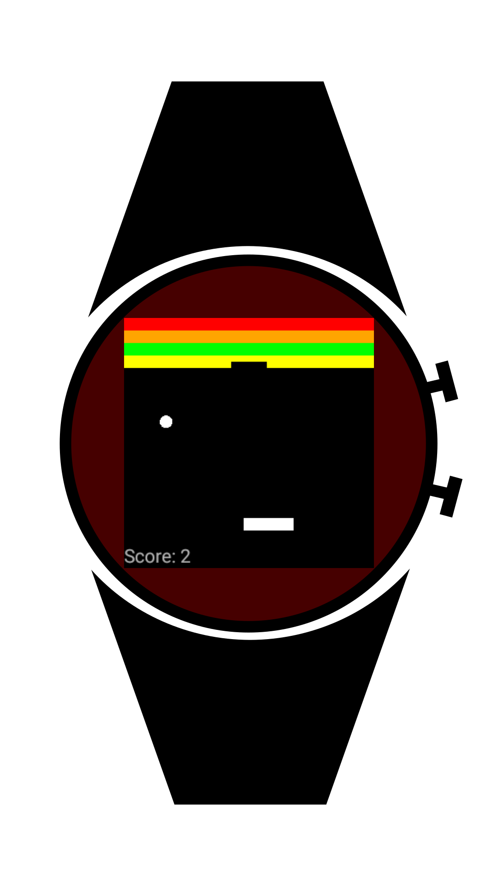

# Breakout for WearOS

A port of the game Breakout (yes, the one from the 70's) for WearOS.
A friend of mine talked about it, and it seemed like a fun project, so here it is!

For those of you who know some opengl(es) and Android development, I am so sorry. This must be terrible, but it was fun, and I did learn a lot from it.  
You can control the cursor with touch or the rotary input.

The game was made to mimic how the game is according to Wikipedia, meaning:
- The ball speeds up on the 4th and 12th hits.
- The ball speeds up after hitting orange for the first time in a game.
- The ball speeds up after hitting red for the first time in a game.
- The cursor shrinks to half its size when hitting red for the first time in a game.

You can find the APK in the releases tab, but hopefully I will be able to put it on Google Play soon enough.

No ads, no payments, obviously.  
Have fun.

Some screenshots:  

How it would look on a round watch:  
